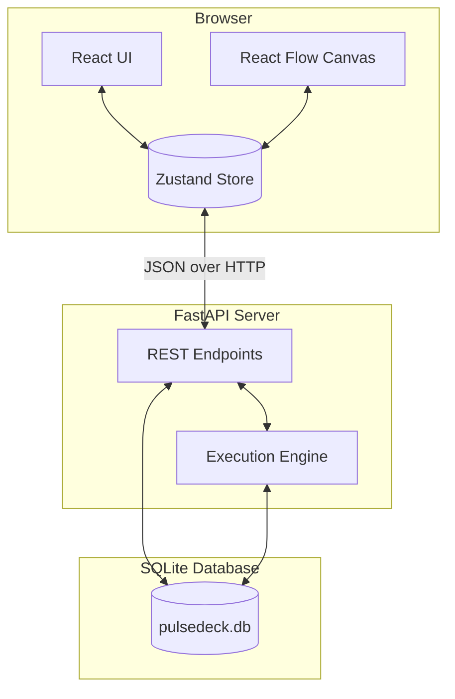
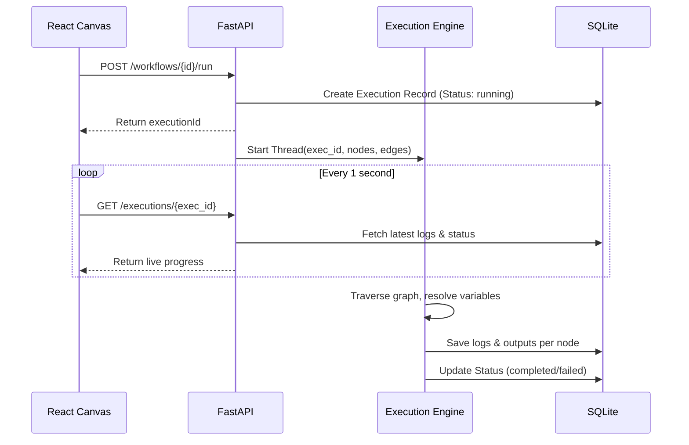

# PulseDeck System Architecture

PulseDeck is a browser-based visual workflow builder designed to encode business logic as an explicit, executable graph. This document outlines the system design, architecture, and core components of both the frontend and backend.

## High-Level System Design

PulseDeck follows a decoupled client-server architecture:

---

## 🎨 Frontend Architecture (`workflow-builder`)

The frontend is built with **React 18** and **Vite**, utilizing a modern, fast toolchain. It acts as the visual designer and orchestrator for creating Directed Acyclic Graphs (DAGs).

### Key Technologies
- **Canvas Interface:** `@xyflow/react` (React Flow)
- **State Management:** `zustand`
- **Styling:** `Tailwind CSS v4`

### State Management (Zustand)
We use Zustand to manage global state without the boilerplate of Redux. The state is divided logically:
1. **Workflow State:** Manages the current loaded workflow, node array, edge array, and global parameters.
2. **Execution State:** Tracks the live status of the running workflow, success/fail states of individual nodes, and execution logs.
3. **UI State:** Controls modals, sidebars, and active selections.

### Canvas & Node Interactions
- **Custom Nodes:** We map our internal node types (e.g., `http_request`, `condition`, `send_sms`) to custom React components rendered by React Flow.
- **Auto-Chaining:** When a user drops a new node onto the canvas, the system automatically draws an edge from the previously selected node to the new node, speeding up workflow creation.
- **Validation:** Before execution, the frontend validates the graph to ensure there are no isolated steps (unless intentional) and that required parameters are filled.

---

## ⚙️ Backend Architecture (`workflow-api`)

The backend is built with **Python 3** and **FastAPI**, serving as both an API layer and the execution runtime.

### Key Technologies
- **Framework:** `FastAPI` (Async, automatic OpenAPI docs)
- **Database:** `SQLite3` (Embedded, zero-config)
- **Concurrency:** `threading` (for asynchronous graph execution)

### Database Schema
The SQLite database stores workflows and their execution histories.

1. **`workflows` Table:**
   - `id` (Primary Key)
   - `workflowName`, `version`, `savedAt`
   - `canvas` (JSON payload containing nodes and edges)
   - `parameters` (Global workflow configuration)

2. **`executions` Table:**
   - `executionId` (Primary Key)
   - `workflowId` (Foreign Key)
   - `status` (running, completed, failed)
   - `logs` (JSON array of timestamped log strings)
   - `nodeResults` (JSON dictionary mapping node IDs to their output payloads)

---

## 🧠 Execution Engine

The core of the backend is the `execution_engine.py`. It is responsible for taking a JSON graph from the frontend and running it sequentially.

### 1. Graph Traversal Strategy
The engine treats the workflow as a Directed Acyclic Graph (DAG). 
- It calculates the **in-degree** of all nodes. Nodes with an in-degree of `0` (or nodes specifically typed as `start`) are pushed into the initial queue.
- It uses a **Breadth-First Search (BFS)** queue to traverse the graph.
- As a node successfully executes, its outgoing edges are analyzed, and target nodes are pushed to the queue.

### 2. Context & Variable Resolution
PulseDeck supports dynamic variable injection. The engine maintains a `context` dictionary during execution:
- Global parameters are stored under `context["global"]`.
- Step outputs are stored under their Node ID: `context["node_1"]["response"]`.

**Variable Syntax:** `{{node_id.key}}`
Before a step runs, the engine scans its configuration string and replaces any instances of `{{...}}` with the actual values resolved from the `context` dictionary using regex mapping.

### 3. Conditional Branching
The `condition` node allows the workflow to split. 
- The node evaluates an expression (e.g., `{{global.status}} == "active"`).
- It produces a Boolean output.
- The engine inspects outgoing edges. It only pushes target nodes to the queue if the edge's `sourceHandle` matches the boolean result (e.g., navigating down the "True" path vs the "False" path).

### 4. Asynchronous Execution
Workflows can take time (e.g., HTTP requests, explicit `delay` nodes). 
- When the `/run` endpoint is called, the API immediately returns a `202 Accepted` and an `executionId`.
- The execution engine spawns a new background `threading.Thread` to traverse the graph.
- The frontend then polls the `/executions/{id}` endpoint to fetch live logs and UI node statuses.

---

## Future Extensibility
- **Database:** The SQLite layer can be easily swapped for PostgreSQL using SQLAlchemy if clustering/horizontal scaling is required.
- **Task Queues:** For production, the `threading` implementation in the execution engine can be replaced with Celery or Redis Queue (RQ) for durable, distributed worker execution.
